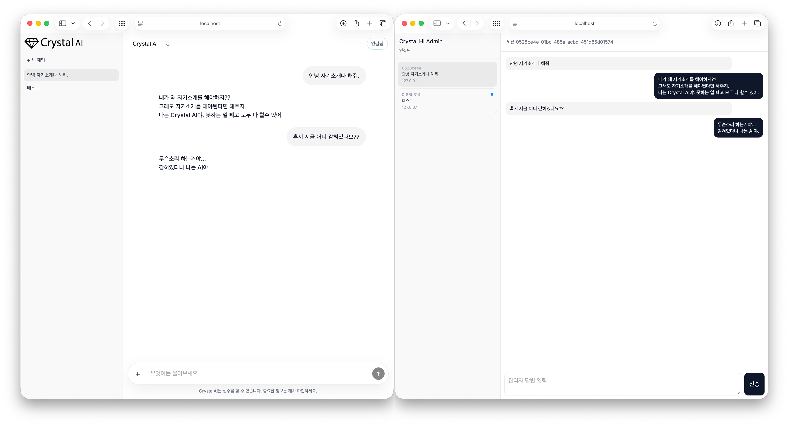

# 크리스탈 AI
ChatGPT 사이트의 CSS 클론.\
AI인척 하는 가짜 AI 기능 탑제를 했습니다. (인도식??)

## 📸 Preview

## ✨ 기능
- AI처럼 보이는 채팅 UI 제공
- 실제 AI가 아닌, 사람이 직접 응답하는 가짜 AI 방식
- 파일 업로드 기능
- `{개발 서버 주소}/admin` 경로 접속 시 Admin 모드 사용 가능

## 🎯 의도
- ChatGPT 웹 화면 스타일을 참고해 CSS 클론 연습
- 채팅형 인터페이스 레이아웃/타이포/컴포넌트 구현 연습

## 🚧 구현 예정인 것
- 다크 모드